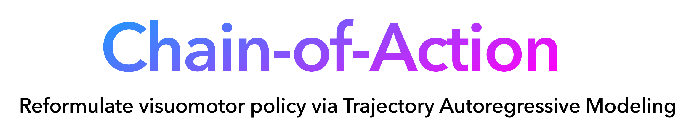

<p align="center">
  
</p>

<p align="center">
  <a href="https://chain-of-action.github.io/"></a> <a href="https://arxiv.org/pdf/2506.09990"></a> <a href="https://huggingface.co/Solomonz/Chain-of-Action"></a> <a href="https://huggingface.co/datasets/Solomonz/Chain-of-Action"></a>
</p>

## Quick start
### Set up environment
  
   ```bash
   conda create -n coa python=3.9 -y
   conda activate coa
   bash scripts/init.sh
   source ~/.bashrc
   ```

install dependencies and RLBench enviroment, see [init.sh](scripts/init.sh) for details

### One-click Evaluation

The script will automatically download the required pretrained snapshot and the necessary evaluation dataset for the specified task.  

```bash
bash scripts/eval.sh task=push_button
```

## Train & Eval
### Download RLBench datasets

Execute the command to download all data.

```bash
python scripts/download_dataset.py
```

#### Detailed usage

```bash
python scripts/download_dataset.py --task reach_target --train-episodes 100 --eval-episodes 25
```

- `--task`: Specify the task name to download (e.g., reach_target, stack_wine). Only one task will be downloaded.
- `--train-episodes`: Number of training episodes per task (default: 100, total 100).
- `--eval-episodes`: Number of evaluation episodes per task (default: 25, total 50).
- To download the recommended 10-task subset, add the `--subset` flag. To download all tasks, do not specify `--task` or `--subset`.

### Evaluation


  ```bash
  python scripts/eval.py task=task_name snapshot=path_to_snapshot
   ```

### Training

  ```bash
  python scripts/train.py task=task_name 
   ```
   
**For detailed parameter settings, please refer to [launch.yaml](src/cfgs/launch.yaml).**

Key parameters include:

- `num_train_steps`: total training steps (default: 20000)
- `batch_size`: training batch size (default: 128)
- `task`: task name (must be specified)
- `demos`: number of demonstrations per task (default: 100)
- `eval_every_steps`: evaluation interval in steps (default: 10000)
- `vis_every_steps`: visualization interval in steps (default: 2000)
- `save_every_steps`: model checkpoint interval in steps (default: 10000)
- `num_eval_episodes`: number of episodes per evaluation (default: 25)

You can customize these parameters by editing `src/cfgs/launch.yaml` directly, or override them via command line arguments (e.g., `python scripts/train.py task=push_button batch_size=64`).

## Directory Structure
- `scripts/`：Training, evaluation, data/snapshot downloading scripts

- `src/`: Main source code directory, including the following subfolders and files:
  - `cfgs/`: Configuration files
  - `dataset/`: Dataset loading and preprocessing 
  - `envs/`: Simulation environment 
  - `methods/`: Algorithm implementations
    - `coa/`: Chain-of-Action
    - `act/`: ACT (To-do)
    - `dp/`: Diffusion policy (To-do)
    - `base.py`, `utils.py`: Common base classes and utilities
  - `utils.py`, `logger.py`, `video.py`, : General utilities and main control scripts
  - `workspace.py`: training workflow

- `exp_local/`: Local experiment results.
  - `checkpoints/`: Model weights
  - `eval_videos/`: Evaluation videos
  - `train.log`: Training log
  - `.hydra/`: Configuration snapshots and Hydra management files
- `README.md`：Project documentation

## Experiments Results

### Evluation over 60 RLBench tasks
Why we use 60 tasks for the main evaluation?
Although the 18 RLBench tasks have been widely adopted as a benchmark since their introduction in “Perceiver-Actor: A Multi-Task Transformer for Robotic Manipulation”, they are primarily used to evaluate 3D-based hierarchical policies that depend heavily on high-precision 3D inputs and motion planners. Many of these tasks are extremely challenging for RGB-only visuomotor policies, often leading to uniformly low success rates and therefore limited discriminative power.


### Evluation over 18 RLBench tasks

To enable convenient comparison with 3D-based hierarchical methods—such as RVT-2, we also report results on the RLBench-18 benchmark. Plase check appendix for more details. 

> Somehow, RLBench (the most popular 3D-policy benchmark) has gained significant traction in VLA benchmarking, yet VLAs remain far from matching 3D SOTA methods such as 3DDA. For various reasons, most VLA policies tend to avoid comparing against all relevant 3D baselines.
>
> — Source: [A Practitioner’s Guide to VLA Evaluation](https://mbreuss.github.io/blog_post_iclr_26_vla.html#practitioners-guide)

As you can see, there is still substantial room for RGB-only visuomotor policies to close the performance gap.


## Note on Open-Source Implementation

The open-source implementation slightly differs from the original version reported in the paper. We reconstructed the entire training and evaluation pipeline for better clarity and reproducibility.

During this process, a few settings were adjusted:

- Both the **latent loss** and **action loss** were changed from **L2** to **L1**.  
- The **multi-token prediction head** was reduced from **5 tokens** to **2 tokens**.

These updates generally lead to improved success rates across most tasks.  
As a result, your observed performance (e.g., **100% on “push button”**) may exceed the numbers reported in the paper.

### Updated Results (Open-Source Version)

For reference, below are the task-level success rates of the open-source implementation compared with those reported in the paper.  
The open-source version generally achieves higher performance due to the modified training configuration.

| Task | Paper version | Open-Source version |
|------|--------------|----------------------|
| Stack Wine | 0.80 | 0.76 |
| Turn Tap | 0.56 | **0.72** |
| Open Drawer | 0.88 | **0.96** |
| Push Button | 0.76 | **1.00** |
| Pick Up Cup | 0.80 | **0.92** |
| Take Lid | 0.80 | **0.92** |
| Press Switch | 0.44 | **0.52** |
| Reach Target | 0.84 | 0.72 |
| Sweep Dust | 0.92 | **0.96** |
| Open Box | 0.76 | **0.96** |
| `Average` | `0.756` | `0.844` |


## Acknowledgement

This repository is built upon the [robobase](https://github.com/robobase-org/robobase) framework.
The reproduced results of ACT and Diffusion Policy (DP) are based on the implementations provided in that repository.

## Citation
```bibtex
@inproceedings{zhang2025chainofaction,
  author    = {Zhang, Wenbo and Hu, Tianrun and Zhang, Hanbo and Qiao, Yanyuan and Qin, Yuchu and Li, Yang and Liu, Jiajun and Kong, Tao and Liu, Lingqiao and Ma, Xiao},
  title     = {Chain-of-Action: Trajectory Autoregressive Modeling for Robotic Manipulation},
  booktitle = {Proceedings of the 39th Annual Conference on Neural Information Processing Systems (NeurIPS)},
  year      = {2025},
}
```

## License

This project is licensed under the Apache License, Version 2.0. See the [LICENSE](LICENSE) file for details. 
